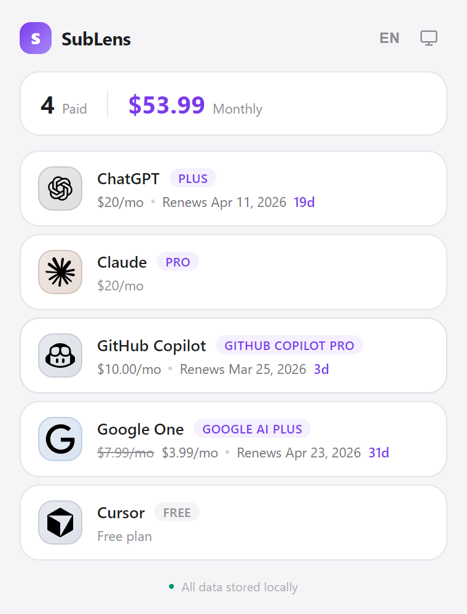

<h1 align="center">SubLens</h1>

<p align="center">
  Track all your AI subscriptions - pricing and billing cycles at a glance.
</p>

<p align="center">
  
  
  
  
</p>

<p align="center">
  
  
</p>

## Features

- **Multi-provider dashboard** — ChatGPT, Claude, GitHub Copilot, Google One, Cursor
- **Subscription cost tracking** — plan pricing, discounted/original price comparison, total monthly spend
- **Billing cycle alerts** — next billing date and days remaining
- **Toolbar badge** — paid subscription count displayed on the extension icon
- **Drag-to-reorder** — arrange cards in your preferred order
- **Dark / Light / System theme** — auto-follows OS preference
- **Multi-language** — English and Simplified Chinese, with locale-aware date and price formatting
- **Privacy-first** — all data stored locally, no external analytics

## Install

### Chrome Web Store

> Coming soon

### Download from Releases

1. Go to [Releases](https://github.com/heartleo/sublens/releases) and download the latest `sublens-vX.X.X.zip`
2. Unzip the file
3. Open `chrome://extensions` → enable **Developer mode**
4. Click **Load unpacked** → select the unzipped `dist/` folder

### Manual Install (Developer Mode)

1. Clone and build:

```bash
git clone https://github.com/heartleo/sublens.git
cd sublens
npm install
npm run build
```

2. Open `chrome://extensions` → enable **Developer mode**
3. Click **Load unpacked** → select the `dist/` folder

## Supported Providers

| Provider                                                         | Price | Billing Cycle |
| ---------------------------------------------------------------- | ----- | ------------- |
|  ChatGPT        | Yes   | Yes           |
|  Claude          | Yes   | Yes           |
|  GitHub Copilot | Yes   | Yes           |
|  Google One   | Yes   | Yes           |
|  Cursor          | Yes   | Yes           |

## Usage Tips

- **Double-click the SubLens logo** to manually refresh all subscriptions
- **Double-click a subscription card** to open the service's dashboard
- **Double-click the "Paid" counter** to highlight paid subscriptions
- **Click the language button** (EN/ZH) to switch between English and Chinese
- **Drag cards** to reorder them — your order is saved automatically

## Development

```bash
npm install          # install dependencies
npm run dev          # start dev server
npm run build        # type-check + production build
npm run build:fast   # production build (skip type-check)
npm run lint         # ESLint
npm run format       # Prettier
```

### Adding a New Provider

1. Create `src/providers/<name>.ts` implementing `SubscriptionProvider`
2. Add host permission in `manifest.json`
3. Register in `src/providers/index.ts`
4. Add logo SVG to `public/logos/`

### Adding a New Language

1. Create `src/i18n/locales/<code>.ts` (use `en.ts` as template)
2. Import and register in `src/i18n/index.ts`
3. Add the locale to the `locales` array in `src/popup/App.tsx`

## Feedback

- If you find SubLens useful, please give it a ⭐
- For bugs or feature requests, feel free to [open an issue](https://github.com/heartleo/sublens/issues).
