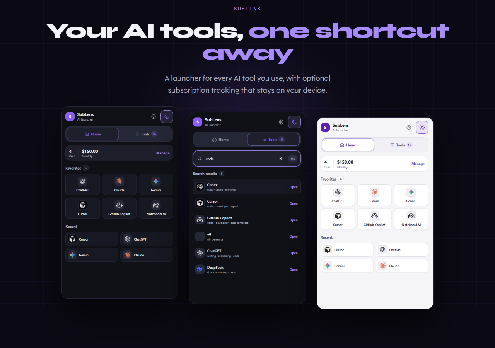
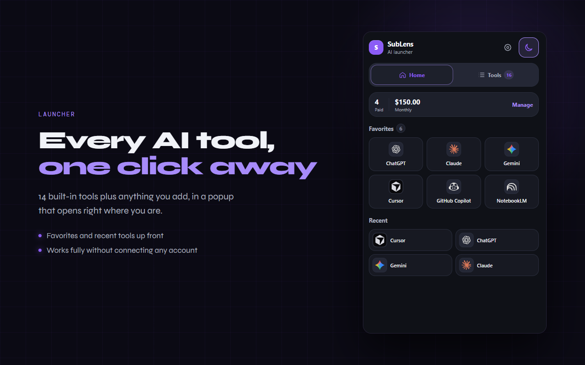
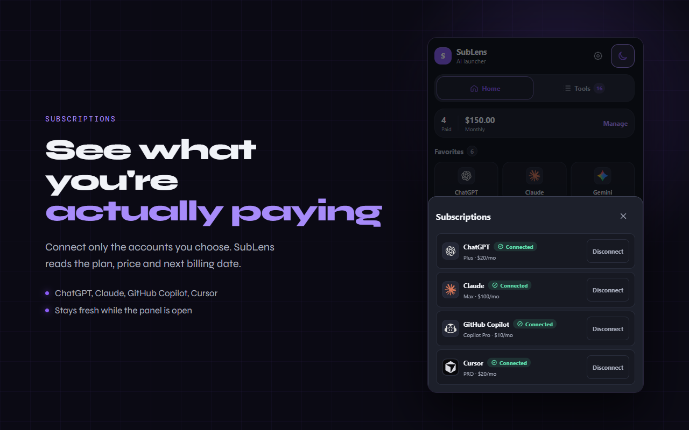
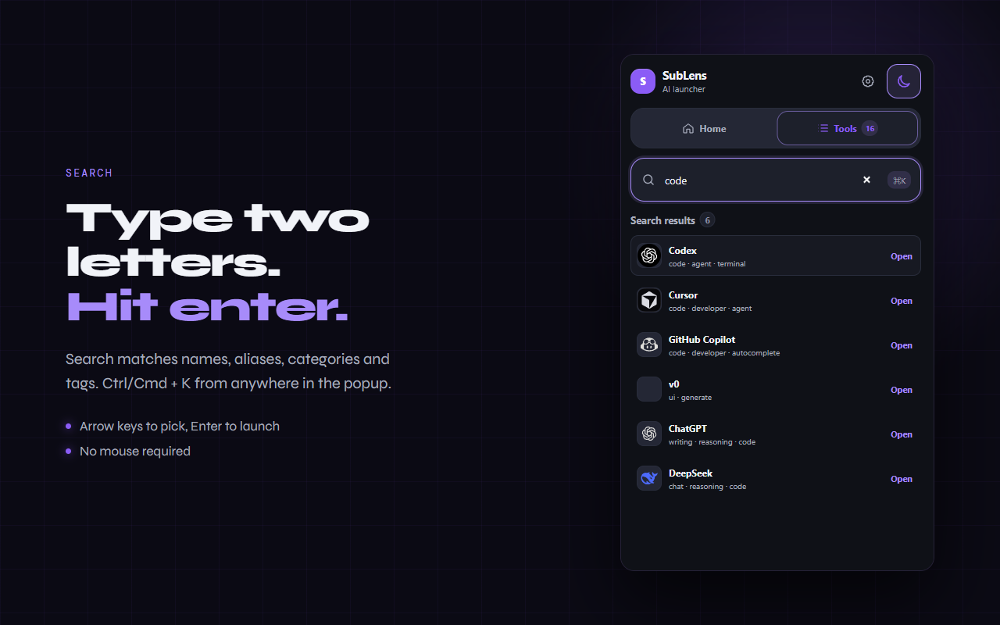
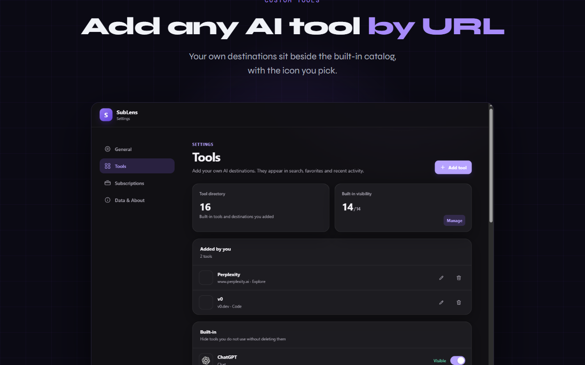

<h1 align="center">SubLens</h1>

<p align="center">
  Launch every AI tool from one popup — and see what you're paying for.
</p>

<p align="center">
  <a href="https://chromewebstore.google.com/detail/sublens/ckhnoellkkppjdcdkcombflmkehabdnh"></a>
  <a href="https://chromewebstore.google.com/detail/sublens/ckhnoellkkppjdcdkcombflmkehabdnh"></a>
  <a href="https://github.com/heartleo/sublens/actions/workflows/ci.yml"></a>
  
  <a href="LICENSE"></a>
</p>

<p align="center">
  <a href="https://chromewebstore.google.com/detail/sublens/ckhnoellkkppjdcdkcombflmkehabdnh"><b>Install from the Chrome Web Store</b></a>
  ·
  <a href="https://heartleo.github.io/sublens/">Website</a>
  ·
  <a href="https://heartleo.github.io/sublens/privacy.html">Privacy</a>
</p>

<p align="center">
  
</p>

## What it does

You probably have five AI tools open in five tabs. SubLens puts them behind one keyboard shortcut,
and — only if you ask it to — shows what each subscription costs and when it renews.

- **Launch anything fast.** 14 built-in AI tools, searchable by name, alias, category, or tag.
- **Add your own.** Any HTTPS URL becomes a tool, deep links included, with an icon you pick.
- **Keyboard first.** `Ctrl/Cmd + K` to search, arrow keys to move, Enter to launch, Escape to clear.
- **Favorites and recents.** The tools you actually use, at the top.
- **Optional subscription tracking.** Connect ChatGPT, Claude, GitHub Copilot, or Cursor to see plan,
  price, next billing date, and your monthly total.
- **Local only.** Everything lives in `chrome.storage.local`. No servers, no analytics, no accounts.

## Install

**[Chrome Web Store](https://chromewebstore.google.com/detail/sublens/ckhnoellkkppjdcdkcombflmkehabdnh)** — one click, no account required.

<details>
<summary>Install from a release build</summary>

1. Download the latest `sublens-vX.X.X.zip` from [Releases](https://github.com/heartleo/sublens/releases)
2. Unzip it
3. Open `chrome://extensions` → enable **Developer mode**
4. **Load unpacked** → select the unzipped `dist/` folder

</details>

<details>
<summary>Build from source</summary>

```bash
git clone https://github.com/heartleo/sublens.git
cd sublens
npm ci
npm run build
```

Then load `dist/` through `chrome://extensions` with **Developer mode** enabled.

</details>

## Screenshots

|                     Launcher                      |                       Subscriptions                       |
| :-----------------------------------------------: | :-------------------------------------------------------: |
|  |  |

|                    Search                     |                       Custom tools                        |
| :-------------------------------------------: | :-------------------------------------------------------: |
|  |          |

## Built-in tools

ChatGPT, Claude, Gemini, DeepSeek, Grok, Midjourney, Runway, Kling AI, Cursor, GitHub Copilot,
Codex, Hugging Face, OpenRouter, and NotebookLM.

Anything missing is one **Settings → Tools → Add tool** away.

## Subscription providers

| Provider                                                         | Plan & price | Billing date |
| ---------------------------------------------------------------- | ------------ | ------------ |
|  ChatGPT        | ✓            | ✓            |
|  Claude          | ✓            | ✓            |
|  GitHub Copilot | ✓            | ✓            |
|  Cursor          | ✓            | ✓            |

Each connection is separate and optional. SubLens requests access to a provider's site only when you
click **Connect**, uses the session you're already signed into, and never reads or stores cookie
values. Disconnecting revokes the host permission.

## Privacy

SubLens has no backend. Favorites, recents, custom tools, preferences, and subscription snapshots are
stored with `chrome.storage.local` on your machine, and requests go straight from your browser to the
provider you connected. Removing the extension deletes everything.

Full policy: [heartleo.github.io/sublens/privacy.html](https://heartleo.github.io/sublens/privacy.html)

## Development

```bash
npm ci               # install the locked dependency set (CI uses Node 20)
npm run dev          # Vite dev server
npm run build        # type-check + production build into dist/
npm run typecheck    # strict TypeScript, no emit
npm run lint         # ESLint
npm test             # Vitest
npm run format       # Prettier
```

Architecture, conventions, and the provider checklist live in [AGENTS.md](AGENTS.md); domain
vocabulary lives in [CONTEXT.md](CONTEXT.md).

### Adding a provider

1. Copy `src/providers/_template.ts` to `src/providers/<provider-id>.ts` and implement `fetch()`
2. Return failures through `SubscriptionInfo.error` — never throw
3. Register it in `src/providers/index.ts`
4. Add the origin to `optional_host_permissions` in `manifest.json`
5. Add an SVG logo to `public/logos/` and update the privacy documentation
6. Run `npm run lint`, `npm run typecheck`, `npm test`, and `npm run build`

### Adding a language

1. Create `src/i18n/locales/<code>.ts` using `en.ts` as the template
2. Register it in `src/i18n/index.ts`
3. Add the locale to the `locales` array in `src/popup/App.tsx`

## Contributing

Issues and pull requests are welcome. Keep commits scoped, use Conventional Commit subjects
(`feat:`, `fix:`, `docs:`), and include before/after screenshots for UI changes.

## License

[MIT](LICENSE). Product names and logos are trademarks of their respective owners; icon attribution
is in [public/logos/THIRD_PARTY_NOTICES.md](public/logos/THIRD_PARTY_NOTICES.md).
