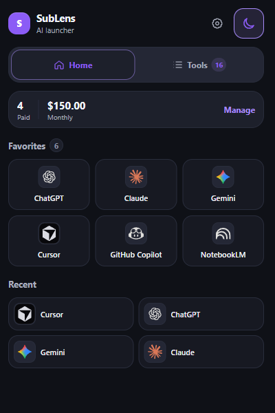
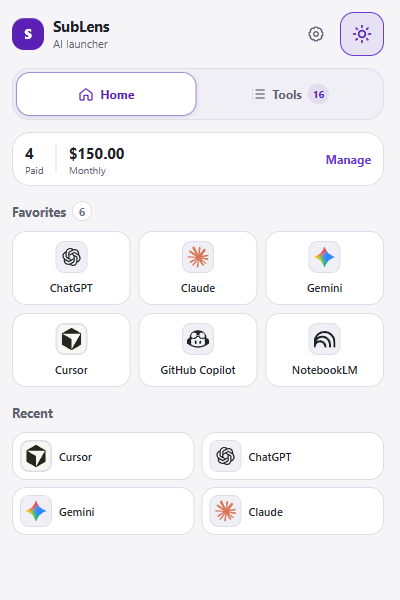

<h1 align="center">SubLens</h1>

<p align="center">
  Launch AI tools fast, then keep connected subscriptions in view.
</p>

<p align="center">
  
  
  
  
</p>

<p align="center">
  
  
</p>

## Features

- **Launcher-first popup** — open 14 built-in AI tools from a compact catalog
- **Fast search** — match names, aliases, categories, subcategories, and tags
- **Keyboard navigation** — `Ctrl/Cmd + K`, arrow keys, Enter, and Escape
- **Favorites and recents** — keep frequent tools one click away with local persistence
- **Optional subscription connections** — connect ChatGPT, Claude, GitHub Copilot, or Cursor individually
- **Subscription summary** — view connected plans, monthly spend, and paid-plan badge count
- **Dark / Light / System theme** — auto-follows OS preference
- **Multi-language** — English and Simplified Chinese, with locale-aware date and price formatting
- **Privacy-first** — provider access is requested on demand; data stays in local extension storage

## Install

### Chrome Web Store

> Coming soon

### Download from Releases

1. Go to [Releases](https://github.com/heartleo/sublens/releases) and download the latest `sublens-vX.X.X.zip`
2. Unzip the file
3. Open `chrome://extensions` → enable **Developer mode**
4. Click **Load unpacked** → select the unzipped `dist/` folder

### Manual Install (Developer Mode)

1. Clone and build:

```bash
git clone https://github.com/heartleo/sublens.git
cd sublens
npm install
npm run build
```

2. Open `chrome://extensions` → enable **Developer mode**
3. Click **Load unpacked** → select the `dist/` folder

## Built-in Tools

ChatGPT, Claude, Gemini, DeepSeek, Grok, Midjourney, Runway, Kling AI, Cursor, GitHub
Copilot, Codex, Hugging Face, OpenRouter, and NotebookLM.

## Subscription Providers

| Provider                                                         | Price | Billing Cycle |
| ---------------------------------------------------------------- | ----- | ------------- |
|  ChatGPT        | Yes   | Yes           |
|  Claude          | Yes   | Yes           |
|  GitHub Copilot | Yes   | Yes           |
|  Cursor          | Yes   | Yes           |

## Usage Tips

- **Click any tool** to open it in a new tab
- **Press `Ctrl/Cmd + K`** to focus search, then use arrow keys and Enter to launch
- **Click the star** to add or remove a favorite
- **Open Subscriptions** to connect only the providers you want to track
- **Click the SubLens logo** to refresh connected subscriptions
- **Click the language button** (EN/ZH) to switch between English and Chinese

## Development

```bash
npm install          # install dependencies
npm run dev          # start dev server
npm run build        # type-check + production build
npm run build:fast   # production build (skip type-check)
npm run lint         # ESLint
npm test             # Vitest unit tests
npm run format       # Prettier
```

### Adding a New Provider

1. Copy `src/providers/_template.ts` to `src/providers/<provider-id>.ts`
2. Replace the provider metadata, response type guard, endpoint, and response mapping
3. Return failures through `SubscriptionInfo.error`; do not throw from `fetch()`
4. Register the provider in `src/providers/index.ts`
5. Add the required host pattern to `optional_host_permissions` in `manifest.json`
6. Add an SVG logo to `public/logos/` and update the privacy documentation when data access changes
7. Run `npm run lint`, `npm run typecheck`, and `npm run build`

Use `createSubscriptionInfo()` from `src/providers/base.ts` for complete defaults. Keep endpoint
details and response types inside the provider adapter so callers only depend on
`SubscriptionProvider`.

### Adding a New Language

1. Create `src/i18n/locales/<code>.ts` (use `en.ts` as template)
2. Import and register in `src/i18n/index.ts`
3. Add the locale to the `locales` array in `src/popup/App.tsx`

## Feedback

- If you find SubLens useful, please give it a ⭐
- For bugs or feature requests, feel free to [open an issue](https://github.com/heartleo/sublens/issues).
